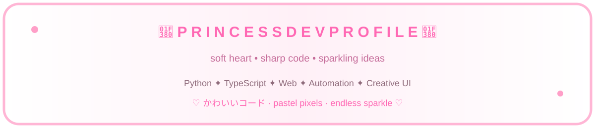

## 🎀 H I · I ' M · E I J I M A

### ♡ cute_developer.exe is online

> A **pink-and-white kawaii developer profile** built around code, creativity, playful interfaces, automation, and tiny details that make everything feel more alive.

---

## 💗 ABOUT ME — SOFT PIXELS, SERIOUS CODE

| 🌸 | My little developer world |
|:---:|:---|
| 🎀 | Building cute things that still work beautifully |
| 💻 | Coding, experimenting, automating, and polishing |
| 🎨 | Obsessed with visual details, UI, motion, and atmosphere |
| 🧸 | Friendly energy, curious mind, slightly chaotic ideas |
| ✨ | Goal: make useful software feel delightful |

## 💞 MY TECH GARDEN

### 🌷 Core stack

**Python** · **TypeScript** · **JavaScript** · **HTML/CSS**  
**React** · **Next.js** · **Node.js** · **Django** · **FastAPI**

### 🎀 Favorite tools

**GitHub** · **GitHub Actions** · **Docker** · **VS Code** · **Figma** · **REST** · **GraphQL**

---

## 🌸 CUTE PROJECT ENERGY

| 🎀 Project style | ✨ What I like building |
|:---|:---|
| 🌷 **Automation** | Bots, workflows, scripts, little helpers |
| 💻 **Web** | Dashboards, interfaces, playful experiences |
| 🧪 **Experiments** | New tools, APIs, ideas, prototypes |
| 🎨 **Creative UI** | Pastel layouts, animations, visual polish |

<b>♡ OPEN THE LITTLE DEVELOPER NOTEBOOK ♡</b>

- ✦ I like projects that feel **personal**, not generic.
- ✦ I enjoy turning technical ideas into something visually memorable.
- ✦ I prefer small details that reward people for exploring.
- ✦ I believe good code and good presentation can coexist.

---

## 📊 GITHUB GARDEN

 

---

## ✨ ACTIVITY — SPARKLES IN MOTION

 

---

## 🩷 PINK STATUS

STATUS · **READY TO CREATE** · MOOD · **✨ SPARKLY** · COFFEE · **☕☕☕**

  

**Coding mode:** ON  
**Sparkle mode:** MAXIMUM  
**Cute level:** ∞

## 💌 CONNECT WITH ME

  

> 🎀 Social badges above are visual profile elements unless linked to a real profile.

---

## 🌷 LITTLE PINK CORNER

### ♡ Thanks for visiting my profile ♡

stay cute · write good code · drink water · keep sparkling ✨

<!-- Pink Princess Developer Profile • refreshed 2026-10-02 -->
