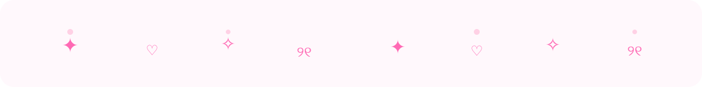
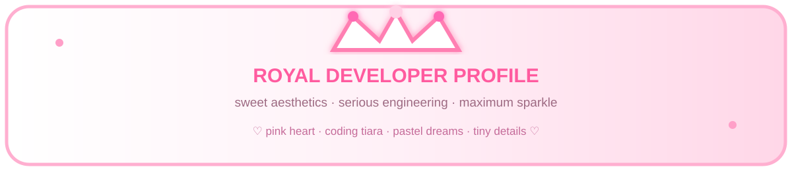
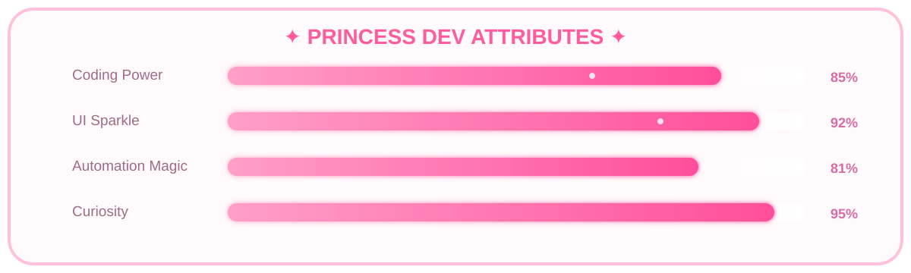
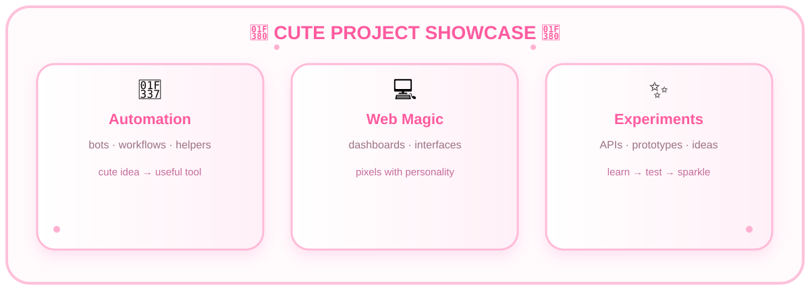
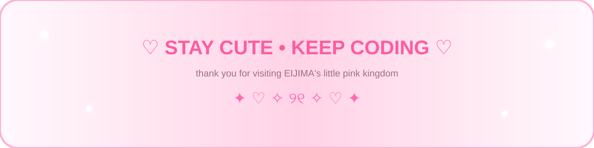

## 🎀♡ E I J I M A ♡🎀

### ✧ cute_princess.exe is ONLINE ✧

> Welcome to my little **pink-and-white developer kingdom** — where serious code wears a ribbon, interfaces sparkle, and every tiny detail gets a little extra love.

---

## 💗 THE PINK PRINCESS DOSSIER

| 🎀 Princess core | ✨ Developer core |
|:---|:---|
| 💕 Pink & white everything | 💻 Code, APIs, automation |
| 🌸 Kawaii interfaces | 🧪 Experiments & prototypes |
| 🎀 Ribbons, bows, sparkle | ⚙️ Workflows & tooling |
| 🧸 Soft, playful energy | 🧩 Practical little systems |
| 👑 Maximum visual drama | 🚀 Ship, iterate, improve |

> 🩷 **Personality preset:** soft outside · sharp inside · sparkle always on

---

## 👑 PRINCESS POWER METER

---

## 💞 MY TECH GARDEN

### 🌷 Languages
**Python** · **Java** · **C** · **C++** · **C#** · **JavaScript** · **TypeScript** · **Go** · **Rust** · **PHP**

### 🎀 Frontend
**HTML** · **CSS** · **React** · **Next.js** · **Vue** · **Angular** · **Tailwind** · **Vite**

### 🩷 Backend & Data
**Node.js** · **Express** · **NestJS** · **Django** · **FastAPI** · **Spring** · **.NET**  
**MySQL** · **PostgreSQL** · **SQLite** · **MongoDB** · **Redis** · **Firebase**

### ✨ Cloud & Tools
**Docker** · **Kubernetes** · **GitHub Actions** · **AWS** · **Azure** · **Nginx** · **Linux**  
**Git** · **GitHub** · **GitLab** · **VS Code** · **Postman** · **Figma** · **Bash** · **REST** · **GraphQL**

---

## 🎀 CUTE PROJECT SHOWCASE

### 🌸 Things I love building

bots · dashboards · automation · web apps · APIs · tiny tools · visual experiments · playful UI

<b>♡ OPEN THE PRINCESS NOTEBOOK ♡</b>

**01 — Make it useful.**  
A cute interface is even better when it solves a real problem.

**02 — Make it memorable.**  
Tiny motion, spacing, color, and micro-interactions can change the whole mood.

**03 — Keep experimenting.**  
Prototype → test → polish → ship → repeat.

**04 — Add one more sparkle.**  
There is always room for one more little detail. ✨

---

## 💎 GITHUB CRYSTAL GARDEN

 

 

---

## ✨ ACTIVITY CATWALK

  

---

## 🎠 LITTLE ROYAL STATUS

  

**👑 Princess mode** ON  
**🎀 Ribbon mode** ON  
**✨ Sparkle mode** MAXIMUM  
**💗 Cute level** ∞

 

compiling... → polishing... → sparkling... → shipped! ♡

---

## 💌 RIBBON MAILBOX

  

---

## 🎀♡ PRINCESS CODEX ♡🎀

<b>OPEN THE SECRET ROYAL CODEX</b>

**Title:** Pink Princess Developer  
**Realm:** EIJIMA's Little Digital Kingdom  
**Specialty:** Cute interfaces, code, automation, experiments  
**Favorite effect:** ✨ glitter  
**Favorite shape:** ♡  
**Emergency protocol:** add more pink  
**Final boss:** a bug hiding in production

> 🌸 **Profile lore notice:** decorative titles, meters, trophies, and role-play elements are purely visual flavor. They are not real credentials or certifications.

---

### ♡ THANK YOU FOR ENTERING MY LITTLE KINGDOM ♡

<!-- Pink Princess / Royal Kawaii Developer Profile • deluxe refresh • 2026-10-02 -->
