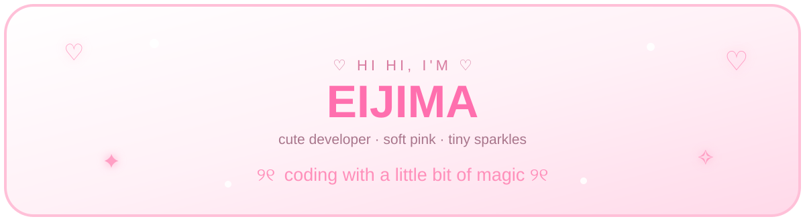
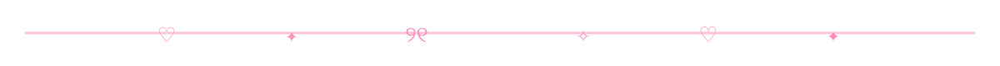
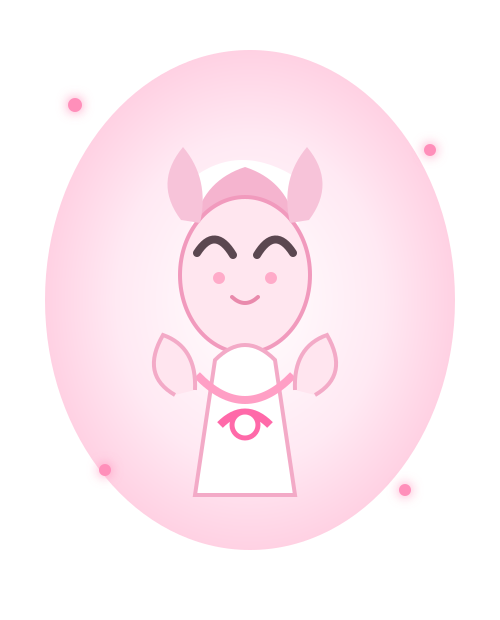
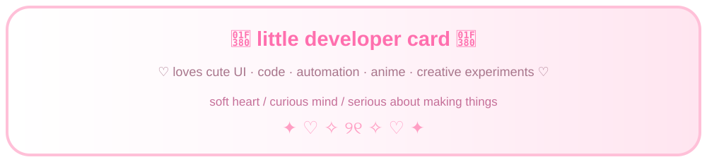
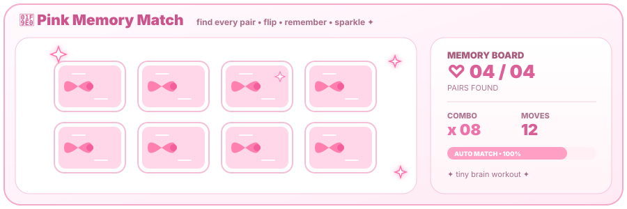
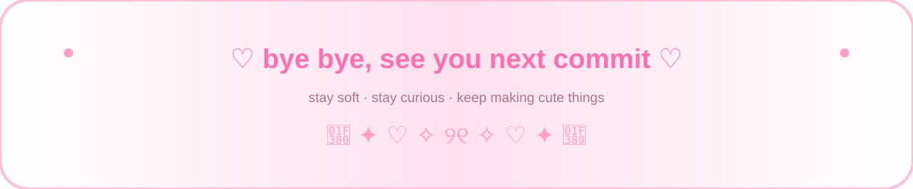

  

## 🎀♡ E I J I M A ♡🎀

### ✧ kawaii developer is online ✧

> Welcome to my little **pink-and-white developer world** — cute interfaces, useful code, playful experiments, automation, and tiny details.

<table><tr><td width="62%" valign="middle">

### 🌸 hi, i am EIJIMA ♡

**soft outside · curious inside · coding always**

🎀 I like making things that feel personal.

💻 I enjoy code, automation, web apps, and experiments.

✨ I love animation, SVG, pastel colors, and little surprises.

💗 My rule: **pretty → surprising → useful**.

</td><td width="38%" align="center">

</td></tr></table>

---

## 💞 my tech garden

**🌷 Languages** — Python · Java · C · C++ · C# · JavaScript · TypeScript · Go · Rust · PHP

**🎀 Web** — HTML · CSS · React · Next.js · Vue · Angular · Tailwind · Vite

**🧁 Backend / Data** — Node.js · Express · NestJS · Django · FastAPI · Spring · .NET · MySQL · PostgreSQL · MongoDB · Redis · Firebase

**✨ Tools** — Git · GitHub · GitHub Actions · Docker · Kubernetes · VS Code · Figma · REST · GraphQL

## 🎠 things i like building

| 🌸 | What I like |

|:---:|:---|

| 🎀 | Cute web apps · dashboards · playful interfaces |

| 🤖 | Bots · scripts · automation · workflows |

| 🧪 | APIs · prototypes · experiments |

| ✨ | SVG · animation · tiny UI details |

<b>🧸 open my tiny notebook</b>

- 🌸 Make useful things feel delightful.

- 🎀 Keep interfaces simple, soft, and memorable.

- ✨ Experiment often.

- 💗 Add tiny details that make people smile.

---

## 📊 my github garden

  

---

## 🧠♡ mini game corner

💗 Pink Memory Match is in auto-play mode — flip the cards, find every pair, and chase the combo.

---

## 💌 come say hi

  

---

## 🧸 tiny status

**🎀 mood:** happy · **🌸 theme:** pink & white · **✨ sparkle:** always on · **💻 coding:** probably  ♡ loading cute ideas... · ♡ adding tiny details... · ♡ making pixels happy...

💗 secret message
If you made it this far: **thank you for visiting ♡**  ✦ ｡ﾟ♡ﾟ｡ ✦ ｡ﾟ♡ﾟ｡ ✦ ｡ﾟ♡ﾟ｡ ✦

<!-- Kawaii Pink Developer Profile • full redesign • 2026-10-02 -->