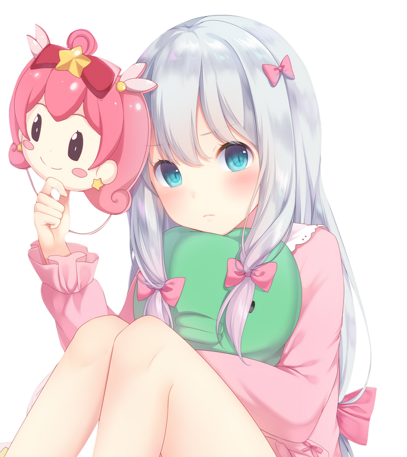
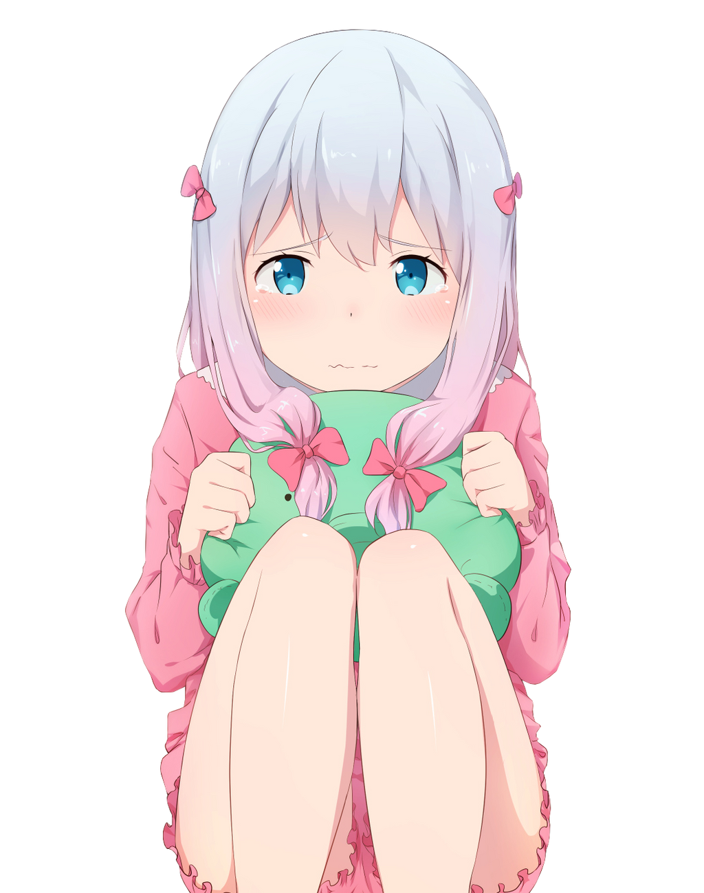
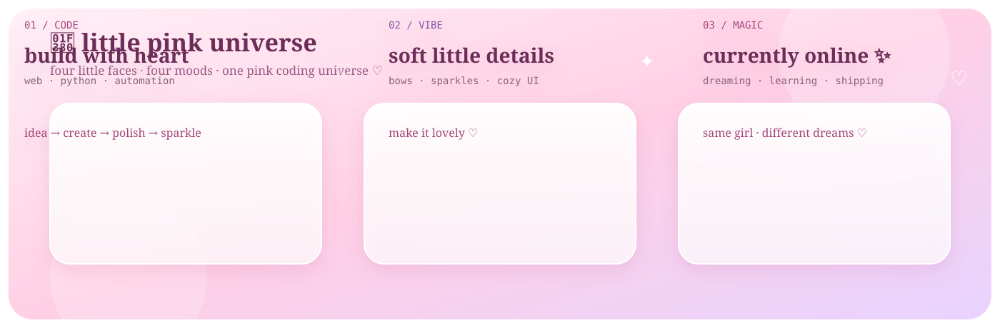
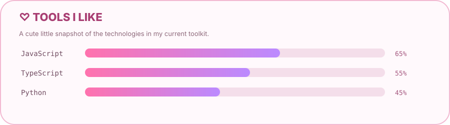
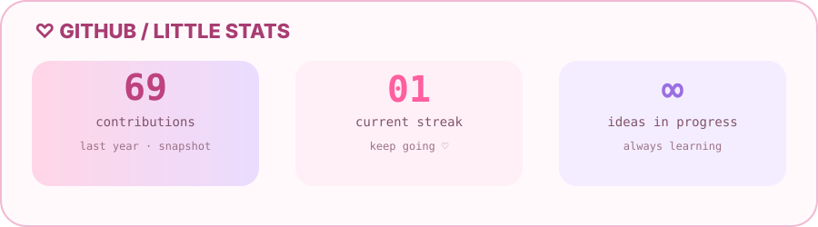
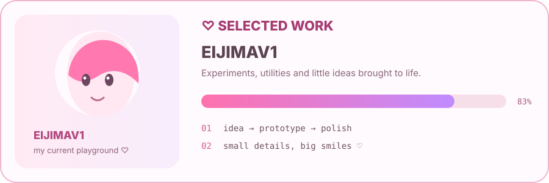
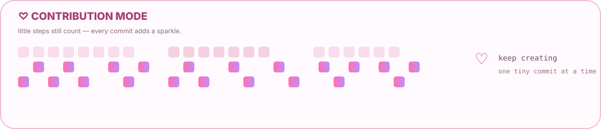

<div align="center">

# 🎀 E1IJIMA · PINK ANIME MODE 🎀







### 💗 SOFT ANIME · CUTE CODE · BIG DREAMS 💗

**A little bit of code · a lot of pink magic.** ✦

<p>


</p>

> 🌸 **Hello! I'm E1IJIMA — coding, creating, learning, and making things prettier.** 🎀

</div>

---

<div align="center">

## ✨ `PINK SHOWCASE`



</div>

---

<table>
<tr>
<td width="62%" valign="top">

## 🎀 `ABOUT ME`

I like building web projects, small tools, automations, experiments, and friendly interfaces. My goal is simple: **make useful things feel beautiful, warm, and memorable.**

```text
♡ vibe       :: pink / dreamy / cozy
♡ mode       :: magical developer
♡ focus      :: web / UI / automation / AI
♡ workflow   :: idea → build → learn → polish
♡ fuel       :: coffee + music + pink energy
```

### 🌷 `CURRENTLY BUILDING`

🌸 turning little ideas into real projects  
🫧 exploring new tools and workflows  
🎀 polishing interfaces and details  
✨ adding tiny moments of joy  
💗 giving static pages a little heartbeat

</td>
<td width="38%" valign="top">

<div align="center">

### 💗 `MY ENERGY`

`SOFT`  ♥ ♥ ♥ ♥ ♥  `100%`  
`CREATIVE`  ✦ ✦ ✦ ✦ ✦  `MAX`  
`CURIOUS`  ✧ ✧ ✧ ✧ ✧  `ONLINE`

<br/>

**code with heart ♡**  
**create with love ♡**  
**build a prettier tomorrow ✨**

</div>

</td>
</tr>
</table>

---

## 💕 `MY LITTLE TOOLBOX`

<div align="center">

</div>

<div align="center">

</div>

---

## 🍓 `A FEW THINGS ABOUT ME`

<table>
<tr>
<td width="33%" align="center">🌸<br/><b>Creative</b><br/><sub>I give projects a personality.</sub></td>
<td width="33%" align="center">🧸<br/><b>Cozy Coder</b><br/><sub>Music + coffee + code.</sub></td>
<td width="33%" align="center">🎀<br/><b>Detail Lover</b><br/><sub>Small details matter.</sub></td>
</tr>
<tr>
<td width="33%" align="center">☁️<br/><b>Curious</b><br/><sub>I learn by making.</sub></td>
<td width="33%" align="center">💞<br/><b>Kind UX</b><br/><sub>Useful should feel lovely.</sub></td>
<td width="33%" align="center">🌙<br/><b>Night Owl</b><br/><sub>Ideas arrive after dark.</sub></td>
</tr>
</table>

---

## 💖 `GITHUB / LITTLE STATS`

<div align="center">

</div>

---

## 🩷 `SELECTED WORK`

<a href="https://github.com/E1IJIMA/E1IJIMAV1"></a>

---

## 🌷 `CONTRIBUTION MODE`



---

<div align="center">

### 🌸 `A LITTLE BIT OF CODE. A LOT OF PINK MAGIC.`

`♡ dream` → `✦ build` → `✧ learn` → `🎀 polish` → `✨ repeat`

<sub>same girl · different dreams · prettier code ♡</sub>

</div>
