---

## ⚔️ HUNTER DOSSIER

> 🜏 **FANTASY PROFILE NOTICE** — every rank, statistic, quest, honor and lore entry below is fictional profile decoration. It is not a real certification, organization ranking or game credential.

---

## 🛡️ ADVENTURER RANK ARCHIVE

<b>OPEN THE FULL GUILD RANK TABLE</b>

| Rank | Guild Meaning |
|---|---|
| **01 — PORCELAIN** | ผู้เริ่มต้น |
| **02 — OBSIDIAN** | นักผจญภัยฝึกหัด |
| **03 — STEEL** | นักรบที่ผ่านสนามจริง |
| **04 — SAPPHIRE** | ผู้พิชิตภารกิจอันตราย |
| **05 — EMERALD** | นักผจญภัยชั้นสูง |
| **06 — RUBY** | นักรบแนวหน้าของกิลด์ |
| **07 — BRONZE** | วีรชนผู้มีชื่อเสียง |
| **08 — SILVER** | นักล่าระดับสูง |
| **09 — GOLD** | ผู้พิทักษ์แห่งอาณาจักร |
| **10 — PLATINUM** | ตำนานที่ยังมีชีวิต |
| **11 — ABYSSAL** | ยศลับแห่งห้วงลึก |
| **12 — MYTHIC** | ยศสูงสุดเหนือบันทึกของกิลด์ |

---

## ☠️ HUNTER ATTRIBUTES

---

## SUPPORTED BY

<table width="100%" bgcolor="#0D1117"><tr><td>

### LANGUAGES
&nbsp;
&nbsp;
&nbsp;
&nbsp;
&nbsp;
&nbsp;
&nbsp;

### FRONTEND
&nbsp;
&nbsp;
&nbsp;
&nbsp;
&nbsp;
&nbsp;
&nbsp;

### BACKEND
&nbsp;
&nbsp;
&nbsp;
&nbsp;
&nbsp;
&nbsp;

### DATA & STORAGE
&nbsp;
&nbsp;
&nbsp;
&nbsp;
&nbsp;

### CLOUD & DEVOPS
&nbsp;
&nbsp;
&nbsp;
&nbsp;
&nbsp;
&nbsp;

### TOOLS & PLATFORMS
&nbsp;
&nbsp;
&nbsp;
&nbsp;
&nbsp;
&nbsp;
&nbsp;

</td></tr></table>

---

## 📜 ACTIVE QUEST LOG

---

## 🏅 BATTLE HONORS

---

## 🔥 WAR RECORDS

## 🔥 SURVIVAL STREAK

`CURRENT STREAK`  **1**  ·  `LONGEST STREAK`  **1**  ·  `TOTAL CONTRIBUTIONS`  **69**

`THE FIRE IS SMALL. THE HUNT IS NOT.`

## 🏆 GUILD TROPHIES

`[ BLACK IRON WARDEN ]`   `[% SILVER ASCENSION ]`   `[ ABYSS MARK ]`

---

## ⚔️ BATTLEFIELD ACTIVITY

## 🐍 THE SERPENT OF THE ABYSS

> **Contribution Snake Workflow:** `.github/workflows/snake.yml` remains enabled to generate the real GitHub contribution snake in the `output` branch.

---

## 🦅 RAVEN MESSENGER

**DISCORD** · `EIJIMA`  
**FACEBOOK** · `EIJIMA`  
**GITHUB** · [`E1IJIMA`](https://github.com/E1IJIMA)

`YOUR_DISCORD_URL`  ·  `YOUR_FACEBOOK_URL`

> **Monsters hide in darkness. Bugs hide in code. I hunt them all.**
>
> *“Victory is not glory. It is the silence left after the final battle.”*

<b>📖 OPEN THE HUNTER'S CODEX</b>

**Identity:** EIJIMA  
**Guild Name:** EIJIMA  
**Class:** Abyss Hunter / Dark Code Knight  
**Alignment:** Chaotic Good  
**Status:** Active  
**Mission:** Purge hostile bugs from the Fallen Digital Realm.  
**Doctrine:** Build quietly. Test brutally. Ship deliberately.

### ⚔️ FORGED IN DARKNESS — BUILT WITH CODE ⚔️

<!-- PLACEHOLDERS: YOUR_GITHUB_USERNAME · YOUR_DISCORD_URL · YOUR_FACEBOOK_URL -->
