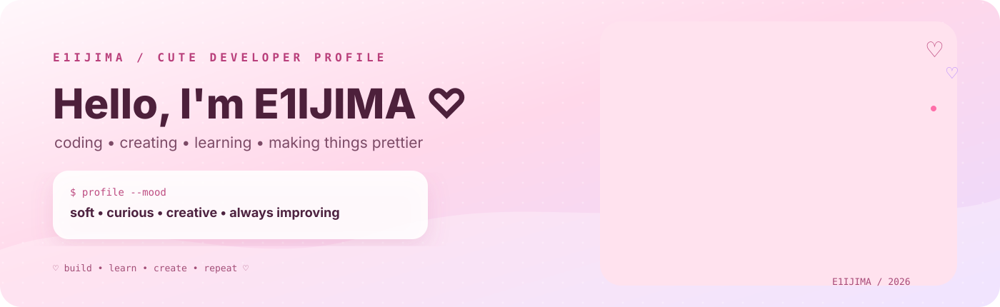

<div align="center">



# E1IJIMA ♡

### `DEVELOPER` · `CREATOR` · `DREAMER`

<a href="https://github.com/E1IJIMA"></a>
<a href="https://github.com/E1IJIMA?tab=repositories"></a>
<a href="https://github.com/E1IJIMA"></a>

**Code, creativity & tiny details — building things with a little extra sparkle.** ✨

</div>

---

<table>
<tr>
<td width="54%" valign="top">

## `♡ WHO AM I?`

> **A curious builder who likes useful things to feel lovely too.**

I enjoy making web projects, little tools, automations, experiments, and interfaces. I like playful visuals, clean UX, and turning random ideas into something people can actually use.

```text
name     :: E1IJIMA
mood     :: soft / curious / creative
focus    :: web / UI / automation / AI
workflow :: idea → make → polish → share
energy   :: coffee + music + late-night ideas ♡
```

### `♡ CURRENTLY BUILDING`

**🌷 Build** — turn ideas into working projects  
**🫧 Tinker** — explore tools, APIs and new ideas  
**🎀 Design** — make interfaces feel friendly  
**✨ Improve** — polish the tiny things that matter

</td>
<td width="46%" valign="top">


</td>
</tr>
</table>

---

## `♡ MY LITTLE TOOLBOX`

<div align="center">


</div>

<br />


---

## `♡ GITHUB / LITTLE STATS`


---

## `♡ SELECTED WORK`

<a href="https://github.com/E1IJIMA/EIJIMAV1"></a>

---

## `♡ CONTRIBUTION MODE`


---

<table>
<tr>
<td width="50%" valign="top">

## `♡ LITTLE THINGS`

```text
♡ I like clean code
♡ I like pretty interfaces
♡ I enjoy learning by building
♡ I collect small ideas
♡ I keep improving old projects
♡ I believe details become personality
```

</td>
<td width="50%" valign="top">

## `♡ BUILDING PHILOSOPHY`

> Make it useful.  
> Make it understandable.  
> Make it feel nice to use.  
> Then add a tiny bit of magic. ✨

</td>
</tr>
</table>

---

<div align="center">

### `♡ KEEP BUILDING CUTE THINGS ♡`

`code` · `create` · `learn` · `repeat`

<br /><br />

<a href="https://github.com/E1IJIMA?tab=repositories"></a>

<br />

<sub>made with curiosity, patience, and a little bit of pink ♡</sub>

</div>
