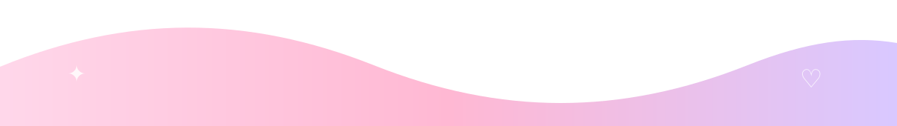
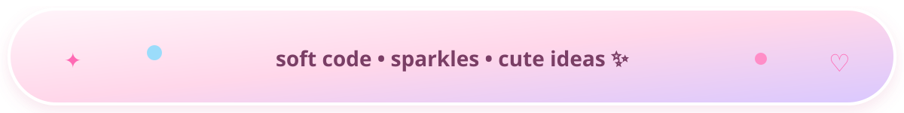
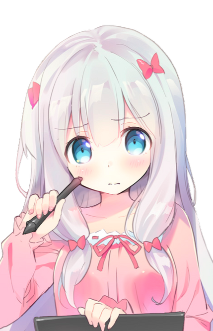
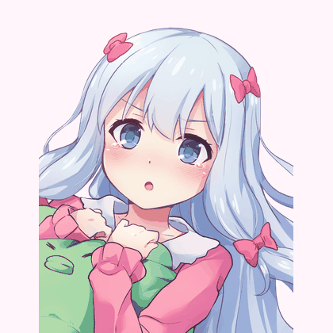
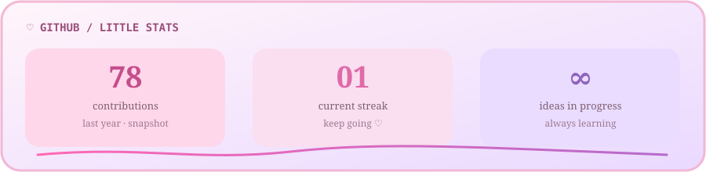
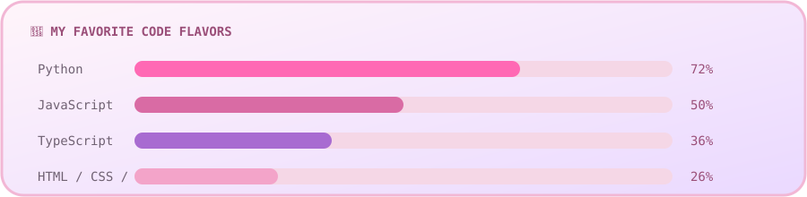
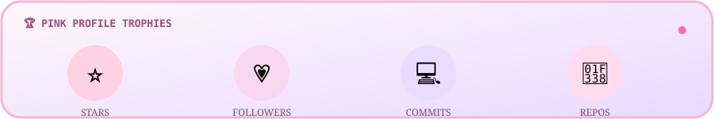
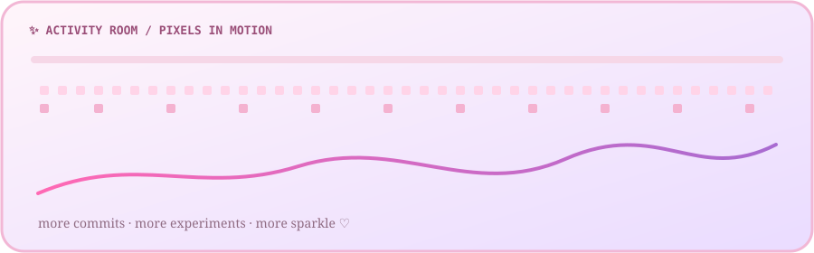

<div align="center">

<!-- ╭──────────────────────────────────────────────────────────────╮ -->
<!--                    P I N K   A N I M E   L A B               -->
<!-- ╰──────────────────────────────────────────────────────────────╯ -->




<br>

<a href="https://github.com/E1IJIMA"></a>
<a href="https://github.com/E1IJIMA/E1IJIMA"></a>
<a href="#-discord-hq"></a>

</div>

<p align="center">
  <sub>♡ かわいいコード / kawaii code • ✦ pastel pixels • 🎀 soft girl developer energy ✦ ♡</sub>
</p>

---

<div align="center">

## 🌸 H I  ·  I ' M  ·  E I J I M A !

</div>

<table>
<tr>
<td width="42%" align="center" valign="middle">


<br>


</td>
<td width="58%" valign="middle">

<h2>Welcome to my little digital universe ✦</h2>

<p>
  I'm <b>EIJIMA</b> — a developer persona who loves the intersection of
  <b>technology, anime aesthetics, community vibes, and tiny details</b>.
</p>

<p>
  My dream is simple: make useful things, make them feel polished,
  and add just enough sparkle that people remember them. ✨
</p>

<p>
  <b>Current mood:</b><br>
  🎧 coding → 💻 customizing → 💬 Discord → 🌸 repeat
</p>

<p>
  
  
  
</p>

</td>
</tr>
</table>

<p align="center">
  
</p>

## 🎀 About Me — soft pixels, serious code

<table>
<tr>
<td width="62%" valign="top">

### ✦ My character sheet

| Attribute | Current vibe |
|---|---|
| 🌷 Role | Creative Developer / Builder |
| 💻 Main quest | Build polished digital experiences |
| 🎧 Comfort zone | Discord, music, late-night coding |
| 🎨 Design language | Pastel pink • purple • white |
| 🧠 Learning style | Build → break → fix → improve |
| ☕ Fuel | Coffee + playlists + unreasonable amounts of curiosity |
| 💗 Weakness | Making one tiny detail look 47% cuter |
| 🌟 Superpower | Turning blank pages into decorated interfaces |

### ✨ Things I genuinely enjoy

> 💬 **Discord:** hanging out, chatting, finding communities, sharing ideas.
>
> 🎀 **Design:** making technical pages feel warm instead of robotic.
>
> 🛠️ **Automation:** letting little scripts do repetitive work for me.
>
> 🌸 **Experimentation:** trying new layouts, visuals, workflows, and tools.

</td>
<td width="38%" align="center" valign="middle">


<br><br>


</td>
</tr>
</table>

---

## 💫 Developer Identity — unlocked

<div align="center">



</div>

<table>
<tr>
<td width="33%" align="center">

### 🌷
**CREATIVE MODE**

UI polish<br>
Visual storytelling<br>
Cute interaction details

</td>
<td width="34%" align="center">

### ⚡
**BUILDER MODE**

Automation<br>
Developer tooling<br>
Experimentation

</td>
<td width="33%" align="center">

### 💬
**SOCIAL MODE**

Discord<br>
Community<br>
Sharing & learning

</td>
</tr>
</table>

> **Simulated profile lore:** the stats, project names, progress levels, and “character sheet” values in this section are playful mock data created to make the profile feel alive. They are not claims about private/off-profile credentials.

---

## 💗 Skills & Tech Garden

<table>
<tr>
<td width="38%" align="center" valign="middle">



<br><br>


</td>
<td width="62%" valign="top">

### 🌸 Core stack

<p>


</p>

<p>


</p>

### 🎀 Tools I like to play with

<p>


</p>

### 🍓 Playful skill meter

| Skill energy | Level |
|---|---|
| 💻 Coding | █████████░ 90% |
| 🎨 UI / visual polish | ██████████ 96% |
| ⚙️ Automation | ████████░░ 84% |
| 💬 Discord social energy | ██████████ 100% |
| 🧪 Experimenting | ██████████ 98% |
| ☕ Surviving late-night bugs | █████████░ 91% |

</td>
</tr>
</table>

<p align="center">
  
</p>

---

## 🌷 Featured Projects — imaginary lab, real aesthetic

<p align="center">
  
</p>

<table>
<tr>
<td width="33%" valign="top">

### 🍓 SakuraBot
**Discord Utility Concept**

A cute imagined Discord companion for reminders, server utilities, reaction games, and tiny community features.

`Python` `Discord` `Automation`

</td>
<td width="34%" valign="top">

### ☁️ PinkCloud
**Developer Dashboard Concept**

A pastel control panel for GitHub activity, personal goals, mini analytics, and “what am I coding right now?” energy.

`TypeScript` `SVG` `Dashboard`

</td>
<td width="33%" valign="top">

### 🎀 KawaiiDesk
**Desktop Companion Concept**

A playful productivity assistant with timers, quick notes, mood widgets, and a soft pink interface.

`Python` `UI` `Productivity`

</td>
</tr>
</table>

<p align="center">
  
</p>

> 🌸 **Project note:** these are intentionally simulated showcase concepts, created to give the profile the polished “developer portfolio” feel you asked for. They are not presented as existing public repositories.

---

## 📊 GitHub Stats — pastel command center

<p align="center">
  
</p>

<p align="center">
  
  
</p>

<p align="center">
  
</p>

<p align="center">
  
</p>

---

## ✨ Activity Room — pixels in motion

<p align="center">
  
</p>

<p align="center">
  <picture>
    <source media="(prefers-color-scheme: dark)" srcset="assets/github-snake.svg">
    
  </picture>
</p>

<p align="center">
  
</p>

<p align="center">
  <sub>🐍 Contribution snake generated by <code>.github/workflows/snake.yml</code> • activity visuals update from GitHub data</sub>
</p>

---

## 💬 Discord HQ — my favorite lobby

<table>
<tr>
<td width="60%" valign="middle">

### 🎧 Probably online somewhere in Discord

Discord is the social side of my developer life — a place to chat, share projects, discover communities, talk about tech, and just chill.

<table>
<tr><td>🟢 Presence</td><td><b>ONLINE-ISH</b></td></tr>
<tr><td>🎮 Current activity</td><td><b>Code + Discord</b></td></tr>
<tr><td>🎵 Background music</td><td><b>Lo-fi / Anime / Pop</b></td></tr>
<tr><td>💬 Social battery</td><td><b>██████████ 100%</b></td></tr>
<tr><td>🌸 Vibe</td><td><b>Friendly • chaotic • sparkly</b></td></tr>
</table>

<p>
  
  
</p>

<!-- Optional live Discord presence — replace YOUR_DISCORD_USER_ID with a real ID and uncomment. -->
<!--
<a href="https://discord.com/users/YOUR_DISCORD_USER_ID">
  
</a>
-->

</td>
<td width="40%" align="center" valign="middle">


<br><br>


</td>
</tr>
</table>

<p align="center">
  <sub>Tip: once a real Discord user ID is available, the commented Lanyard card above can show live Discord presence.</sub>
</p>

---

## 📨 Connect With Me

<div align="center">

<a href="https://github.com/E1IJIMA"></a>


<br><br>

<sub>Only the GitHub link above is verified. Other buttons are visual placeholders until real accounts/URLs are provided.</sub>

</div>

---

## 💖 Little Pink Corner

<table>
<tr>
<td width="50%" align="center" valign="middle">

### 🌸 Visitor counter


</td>
<td width="50%" align="center" valign="middle">

### ⭐ GitHub followers

<a href="https://github.com/E1IJIMA?tab=followers">
  
</a>

</td>
</tr>
</table>

<table>
<tr>
<td width="50%" align="center" valign="middle">

</td>
<td width="50%" align="center" valign="middle">

</td>
</tr>
</table>

<div align="center">

```text
╭──────────────────────────────────────────────╮
│      ✦ little pink corner / no broken img ✦  │
│      ♡ direct repository images only ♡        │
╰──────────────────────────────────────────────╯
```

### ♡ Thanks for visiting my profile ♡

`stay cute` • `write good code` • `drink water` • `go touch grass` • `come back to Discord` 🌸


</div>

<p align="center">
  
  
</p>

<!--
╔══════════════════════════════════════════════════════════════════════╗
║  PINK ANIME DEVELOPER PROFILE                                      ║
║  Designed as a visually rich showcase.                             ║
║  Simulated lore/cards are intentionally marked above.              ║
╚══════════════════════════════════════════════════════════════════════╝
-->
