<div align="center">



# E1IJIMA ♡

### `DEVELOPER` · `CREATOR` · `DREAMER`

<p>


</p>

**A tiny pink corner where code, ideas, and cute details live together.** ✨

</div>

<table>
<tr>
<td width="50%" valign="top">

## 🌸 `ABOUT ME`

> **Hello! I make useful things a little softer, prettier, and more fun.**

I enjoy building web projects, small tools, automations, experiments, and interfaces. I like clean code, cozy visuals, and the tiny details that make a project feel special.

```text
♡ name      :: E1IJIMA
♡ vibe      :: pink / cozy / curious
♡ focus     :: web / UI / automation / AI
♡ workflow  :: idea → build → polish → share
♡ mission   :: make useful things delightful
```

### 🎀 `CURRENTLY BUILDING`

🌷 **create** — turning little ideas into real projects  
🫧 **explore** — trying new tools and workflows  
🎀 **design** — making interfaces warmer and friendlier  
✨ **polish** — adding the details people remember

</td>
<td width="50%" valign="top">


</td>
</tr>
</table>

---

## 💗 `MY LITTLE TOOLBOX`

<div align="center">

</div>

<div align="center">

</div>

---

## 🍓 `A FEW THINGS ABOUT ME`

<table>
<tr>
<td width="33%" align="center">🌸<br/><b>Creative</b><br/><sub>I like giving projects a personality.</sub></td>
<td width="33%" align="center">🧸<br/><b>Cozy Coder</b><br/><sub>Music + coffee + code.</sub></td>
<td width="33%" align="center">🎀<br/><b>Detail Lover</b><br/><sub>Small details make big differences.</sub></td>
</tr>
<tr>
<td width="33%" align="center">☁️<br/><b>Curious</b><br/><sub>I learn by making things.</sub></td>
<td width="33%" align="center">💞<br/><b>Kind UX</b><br/><sub>Useful should feel lovely too.</sub></td>
<td width="33%" align="center">🌙<br/><b>Night Owl</b><br/><sub>Some of my ideas arrive late.</sub></td>
</tr>
</table>

---

## 💕 `GITHUB / LITTLE STATS`

<div align="center">

</div>

---

## 🩷 `SELECTED WORK`

<a href="https://github.com/E1IJIMA/E1IJIMAV1"></a>

---

## 🌷 `CONTRIBUTION MODE`


---

<table>
<tr>
<td width="58%" valign="top">

## 🐰 `LITTLE THINGS`

```text
♡ cute interfaces
♡ useful little tools
♡ anime-inspired visuals
♡ learning through projects
♡ tiny experiments
♡ improving old ideas
♡ collecting inspiration
```

</td>
<td width="42%" valign="top">

## 🎀 `MY PHILOSOPHY`

> Build something useful.  
> Make it easy to understand.  
> Make it nice to use.  
> Add a little sparkle. ✨

</td>
</tr>
</table>

---

<div align="center">

### 🌸 `KEEP MAKING CUTE THINGS ♡`

**dream** · **create** · **improve** · **repeat**

<p>

</p>

<sub>made with curiosity, patience, and a little bit of pink ♡</sub>

</div>
