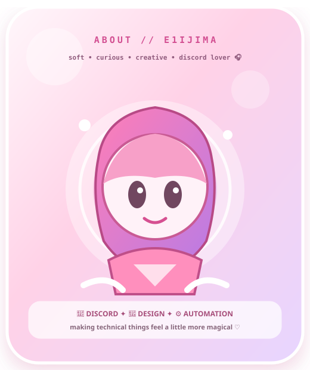

<div align="center">

<a href="https://github.com/E1IJIMA">

</a>


</div>

# 💗 E1IJIMA's little pink universe

> 🎀 **cute code · soft anime · tiny magic · big dreams**
>
> I build useful things, polish friendly interfaces, experiment with automation and AI, and leave a little sparkle in the details.

<div align="center">

**🌸 DREAM**  →  **🛠️ BUILD**  →  **🫧 LEARN**  →  **🎀 POLISH**  →  **✨ REPEAT**

</div>


## 🌷 my vibe

<table width="100%">
<tr>
<td width="50%" valign="top" bgcolor="#fff3f9">

### 🎀 soft & creative

I love projects that feel warm, clear, playful, and intentionally designed.

**pink energy:** `██████████ 100%`

**curiosity:** `██████████ 100%`

**tiny details:** `██████████ 100%`

</td>
<td width="50%" valign="top" bgcolor="#ffe8f3">

### 💻 build mode

```text
focus    :: web / UI / automation / AI
style    :: dreamy / cute / polished
workflow :: idea → prototype → refine
favorite :: making static things feel alive
```

</td>
</tr>
</table>

## 🩷 anime corner

<div align="center">


<br/>

<sub>♡ all four images above are local assets from this repository • the hero above loops through them</sub>

</div>


## 💕 currently creating

<table width="100%">
<tr>
<td align="center" bgcolor="#fff0f7">🌸<br/><b>little web experiences</b><br/><sub>clean UI with personality</sub></td>
<td align="center" bgcolor="#ffe5f1">🫧<br/><b>automation ideas</b><br/><sub>less busywork, more magic</sub></td>
<td align="center" bgcolor="#fff0f7">✨<br/><b>AI experiments</b><br/><sub>learning by making</sub></td>
</tr>
<tr>
<td align="center" bgcolor="#ffe5f1">🎀<br/><b>interface polish</b><br/><sub>spacing, motion, tiny details</sub></td>
<td align="center" bgcolor="#fff0f7">🧸<br/><b>cozy tools</b><br/><sub>useful things that feel lovely</sub></td>
<td align="center" bgcolor="#ffe5f1">💗<br/><b>new ideas</b><br/><sub>turning sketches into real projects</sub></td>
</tr>
</table>

## 💻 little toolbox

<div align="center">


<br/><br/>


</div>


## 🌸 selected work

<div align="center">

<a href="https://github.com/E1IJIMA/E1IJIMAV1">

</a>

</div>

## 💖 github sparkle board

<div align="center">


</div>

## 🍓 tiny things about me

<table width="100%">
<tr>
<td width="33%" align="center" bgcolor="#fff1f7">🌸<br/><b>Creative</b><br/><sub>Every project gets a personality.</sub></td>
<td width="33%" align="center" bgcolor="#ffe7f2">🧸<br/><b>Cozy Coder</b><br/><sub>Music + coffee + code.</sub></td>
<td width="33%" align="center" bgcolor="#fff1f7">🎀<br/><b>Detail Lover</b><br/><sub>Small details make the mood.</sub></td>
</tr>
<tr>
<td width="33%" align="center" bgcolor="#ffe7f2">☁️<br/><b>Curious</b><br/><sub>I learn by building things.</sub></td>
<td width="33%" align="center" bgcolor="#fff1f7">💞<br/><b>Kind UX</b><br/><sub>Useful should also feel lovely.</sub></td>
<td width="33%" align="center" bgcolor="#ffe7f2">🌙<br/><b>Night Owl</b><br/><sub>Ideas like to arrive late.</sub></td>
</tr>
</table>


<div align="center">

## 🎀 thank you for visiting my pink corner

**♡ keep learning · ✦ keep creating · ✧ keep making the internet a little cuter**



<br/>

<sub>made with code, curiosity, and a suspicious amount of pink energy.</sub>

</div>
