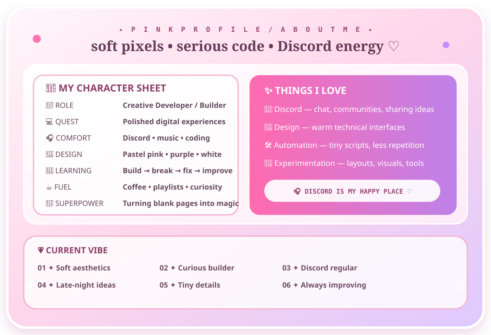
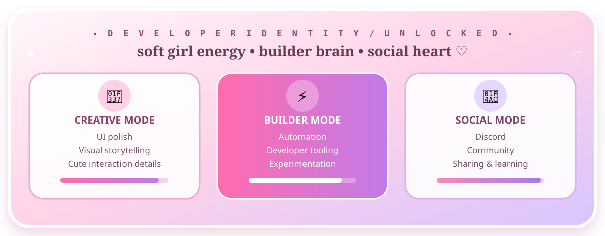

<table>
<tr>
<td width="46%" align="center" valign="middle">

  

</td>
<td width="54%" valign="middle">

# 🌸 H I · I ' M · E I J I M A !

### `cute_developer.exe` is online ♡

> A pink-anime developer profile built around **code, creativity, community, and tiny details that make interfaces feel alive.**

</td>
</tr>
</table>

### ✦ `profile --status`

♡ かわいいコード / kawaii code • ✦ pastel pixels • 🎀 soft girl developer energy • 🎧 Discord lover ♡

---

## 🎀 About Me — soft pixels, serious code

🌸 A playful simulated profile card — created for the visual portfolio aesthetic.

---

## 💫 Developer Identity — unlocked

> **Simulated profile lore:** the character values, progress levels, and identity-card details are playful mock data created to make the profile feel alive. They are not claims about private credentials.

---

## 💗 Skills & Tech Garden

<table>
<tr>
<td width="38%" align="center" valign="middle">

  

</td>
<td width="62%" valign="top">

### 🌸 Core stack

### 🎀 Tools I like to play with

### 🍓 Playful skill meter

| Skill energy | Level |
|---|---|
| 💻 Coding | █████████░ 90% |
| 🎨 UI / visual polish | ██████████ 96% |
| ⚙️ Automation | ████████░░ 84% |
| 💬 Discord social energy | ██████████ 100% |
| 🧪 Experimenting | ██████████ 98% |

</td>
</tr>
</table>

---

## 🌷 Featured Projects — imaginary lab, real aesthetic

<table>
<tr>
<td width="33%" valign="top">
### 🍓 SakuraBot
**Discord Utility Concept**

A cute imagined Discord companion for reminders, server utilities, reaction games, and tiny community features.

`Python` `Discord` `Automation`
</td>
<td width="34%" valign="top">
### ☁️ PinkCloud
**Developer Dashboard Concept**

A pastel control panel for GitHub activity, personal goals, mini analytics, and coding mood.

`TypeScript` `SVG` `Dashboard`
</td>
<td width="33%" valign="top">
### 🎀 KawaiiDesk
**Desktop Companion Concept**

A playful productivity assistant with timers, quick notes, mood widgets, and a soft pink interface.

`Python` `UI` `Productivity`
</td>
</tr>
</table>

> 🌸 **Project note:** these are intentionally simulated showcase concepts. They are not presented as existing public repositories.

---

## 📊 GitHub Stats — pastel command center

---

## ✨ Activity Room — pixels in motion

<picture><source media="(prefers-color-scheme: dark)" srcset="assets/github-snake.svg"></picture>

---

## 💬 Discord HQ — my favorite lobby

<table>
<tr>
<td width="60%" valign="middle">

### 🎧 Probably online somewhere in Discord

Discord is the social side of my developer life — a place to chat, share projects, discover communities, talk about tech, and just chill.

| 🎧 Discord mode | `ONLINE-ISH` |
|---|---|
| 🎮 Current activity | Code + Discord |
| 🎵 Background | Lo-fi / Anime / Pop |
| 💬 Social battery | ██████████ 100% |
| 🌸 Vibe | Friendly • chaotic • sparkly |

<!-- Optional live Discord presence — replace YOUR_DISCORD_USER_ID with a real ID and uncomment. -->
<!--  -->

</td>
<td width="40%" align="center" valign="middle">

  
</td>
</tr>
</table>

---

## 📨 Connect With Me

---

## 💖 Little Pink Corner

<table><tr>
<td width="50%" align="center"><b>🌸 VISITORS</b> </td>
<td width="50%" align="center"><b>⭐ GITHUB FOLLOWERS</b> </td>
</tr></table>

### ♡ Thanks for visiting my profile ♡

`stay cute` • `write good code` • `drink water` • `go touch grass` • `come back to Discord` 🌸

<!-- Simulated showcase values are intentionally labeled. -->
