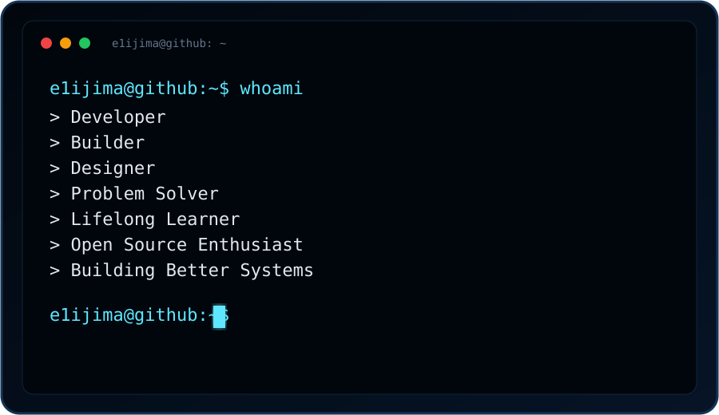

<div align="center">



# E1IJIMA

### `DEVELOPER` · `BUILDER` · `DESIGNER`

<a href="https://github.com/E1IJIMA"></a>
<a href="https://github.com/E1IJIMA?tab=repositories"></a>
<a href="https://komarev.com/ghpvc/?username=E1IJIMA"></a>

**Code, creativity & experiments — building things worth remembering.**

</div>

<table>
<tr>
<td width="52%" valign="top">

## `WHOAMI`

> **Curious mind. Practical builder.**

I build digital tools, web experiences, automations, and experiments. I like clean interfaces, useful systems, and the little details that make a project feel finished.

```text
identity   :: E1IJIMA
role       :: developer / builder / designer
focus      :: web / automation / AI / tooling / UX
workflow   :: idea → prototype → build → refine
standard   :: useful > noisy
```

### `CURRENTLY BUILDING`

**⚡ Build** — turn rough ideas into working software  
**⚙️ Automate** — remove repetitive work  
**🧪 Experiment** — test new tools and interfaces  
**✦ Refine** — simplify, polish, repeat

### `TECH / TOOLKIT`

<p align="center">

</p>

</td>
<td width="48%" valign="top">



</td>
</tr>
</table>

---

## `GITHUB / SIGNAL`

<div align="center">
<a href="https://github.com/E1IJIMA"></a>
<a href="https://github.com/E1IJIMA"></a>
</div>

<div align="center">

</div>

---

## `SELECTED WORK`

<table>
<tr>
<td width="50%" valign="top">

<a href="https://github.com/E1IJIMA/EIJIMAV1">

</a>

</td>
<td width="50%" valign="top">

### `BUILD LOG`

```text
01  idea        ████████████████████ 100%
02  prototype   █████████████████░░░  88%
03  build       ███████████████████░  96%
04  polish      ███████████████░░░░░  78%
```

> shipping is the feature.

</td>
</tr>
</table>

---

## `CONTRIBUTION MODE`

<div align="center">

</div>

---

## `BUILD PHILOSOPHY`

```diff
+ Make it useful.
+ Make it readable.
+ Make it memorable.
+ Keep the interface intentional.
+ Learn fast. Iterate often.
+ Leave the codebase better than you found it.
- Ship noise just to look busy.
```

<div align="center">

### `BUILD • LEARN • CREATE • REPEAT`

<sub>Code with intent. Create with curiosity. Keep moving forward.</sub>

<br /><br />

<a href="https://github.com/E1IJIMA"></a>

</div>
